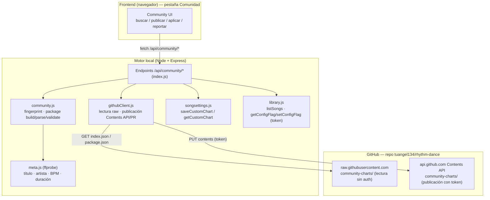
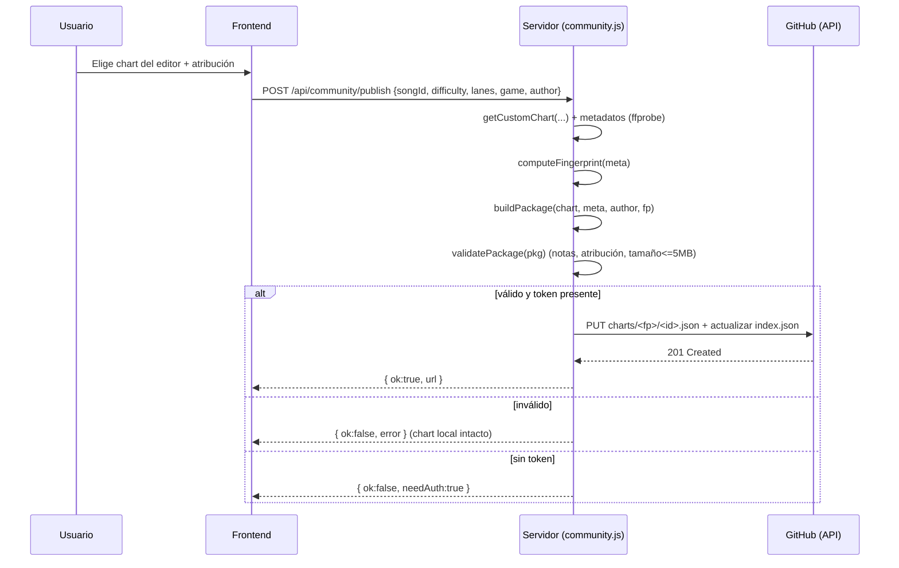
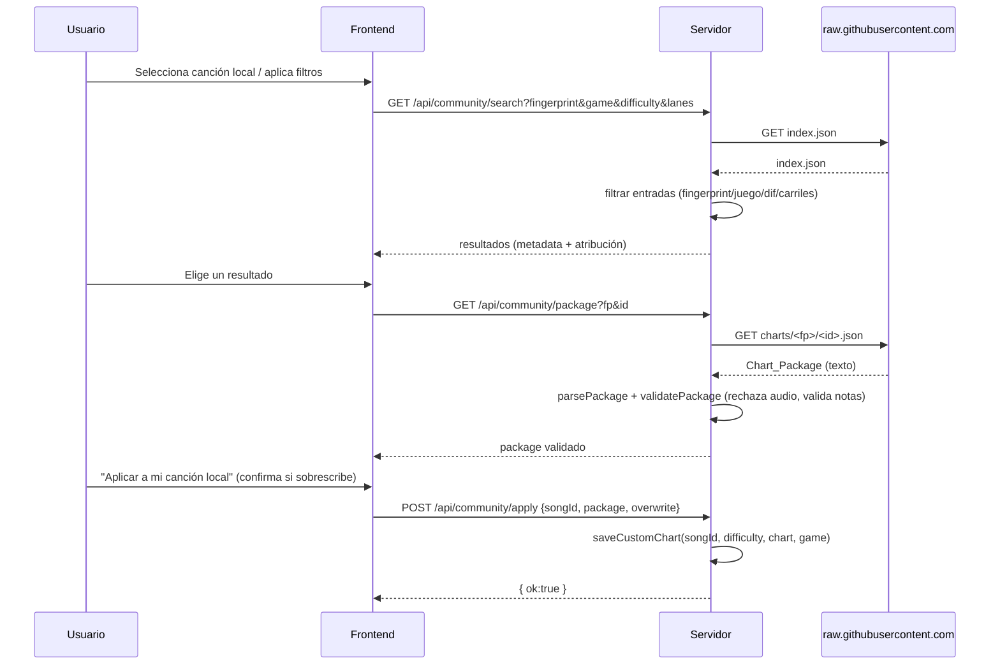

# Documento de Diseño — community-charts

## Overview

Esta funcionalidad añade un subsistema (**Community_Charts_System**) que permite a la
comunidad de Rhythm Dance **compartir charts** (mapeos de notas) a través de GitHub,
**sin distribuir audio**. El usuario puede publicar un chart hecho en el editor,
buscar charts de otros, descargarlos y aplicarlos a sus propias canciones locales.

El principio rector es el **respeto a los derechos de autor**: un `Chart_Package`
contiene únicamente notas y metadatos descriptivos, nunca audio. La vinculación de
un chart con la canción correcta se hace con un **Song_Fingerprint** reproducible,
derivado de metadatos no sonoros (título, artista, duración, BPM), de modo que el
usuario empareja el chart con su propio archivo local.

Además, el juego mantiene un **catálogo local** (Local_Chart_Catalog) sincronizado
desde GitHub al arrancar: una copia del índice de la comunidad (solo metadatos +
notas, sin audio). Con ese catálogo, cuando el usuario **descarga una canción**, el
juego detecta al instante si ya existen charts para ella y le **avisa** para que
pueda usarlos (por juego y dificultad) en lugar de la generación automática.

El diseño se ancla en el código existente del proyecto y reutiliza sus convenciones:

- **Almacenamiento local**: `songsettings.js` ya persiste charts del editor en
  `~/.rhythm-dance/songdata.json` con separación por juego (`gkey`) y por carriles
  (`ckey = ${difficulty}@${lanes}`). El diseño reusa `saveCustomChart` /
  `getCustomChart` para *aplicar* un chart descargado, conservando la separación
  4/5 carriles ya existente.
- **Configuración local**: `library.js` expone `getConfigFlag` / `setConfigFlag`
  sobre `~/.rhythm-dance/config.json`. El token de GitHub del usuario se guarda ahí
  y **nunca** se sube ni se expone al frontend.
- **Metadatos**: `decode.js` ya tiene `probeDuration` (ffprobe). Se añade una
  extracción ligera de tags (título/artista/BPM) con ffprobe para alimentar el
  fingerprint. La duración y BPM también están disponibles en el beatmap generado.
- **Endpoints Express**: `index.js` define el patrón a seguir (rutas `/api/*`,
  `express.json({ limit: "50mb" })`, manejo de errores con códigos descriptivos).
- **Frontend**: `src/main.js` + `index.html` usan pestañas (`data-tab` /
  `tab-panel`) y `fetch("/api/*")`. Se añade una pestaña nueva **"Comunidad"**.

### Requisitos que cubre el Overview
Establece el marco para los Requisitos 1–8 (sin audio, fingerprint, package,
publicar, buscar, descargar, aplicar, atribución y validación).

---

## Architecture

### Decisión 1: GitHub como almacén de charts (mismo repositorio del proyecto)

**Decisión (elegida por el usuario): MISMO repositorio.** Los `Chart_Package` de la
comunidad viven **dentro del repositorio del propio proyecto**
(`tuangel134/rhythm-dance`), en una carpeta dedicada `community-charts/`, junto con
un **índice JSON** (`community-charts/index.json`) más un archivo por chart.

El juego **lee** vía `raw.githubusercontent.com/tuangel134/rhythm-dance/main/...`
(sin autenticación) para buscar/descargar, y **publica** vía la **GitHub Contents
API** sobre el mismo repo usando un **token personal** del usuario. Como alternativa
de moderación, se puede publicar abriendo un **Pull Request** contra el repo del
proyecto (modo seleccionable).

**Implicaciones de usar el mismo repo (asumidas):**

1. **Lectura sin fricción y sin auth.** Igual que con un repo separado,
   `raw.githubusercontent.com` sirve `community-charts/index.json` y cada package
   como archivos estáticos. La búsqueda y descarga funcionan sin que el usuario
   configure nada.
2. **Una sola fuente.** Charts y código conviven en el mismo repositorio: un solo
   lugar que clonar, respaldar y versionar. Simplifica la operación (no hay que
   crear ni mantener un segundo repo) a cambio de que los commits de datos queden
   en el historial del proyecto.
3. **Publicación auto-servida.** Con un token personal con permiso de escritura, el
   contribuidor publica directo a `community-charts/` vía la Contents API (un commit
   por chart). Para moderar antes de aceptar, el modo **Pull Request** deja la
   revisión en manos de un mantenedor.
4. **Aislamiento por carpeta.** Todo lo de la comunidad queda confinado a
   `community-charts/`, separado del código (`src/`, `server/`, etc.), de modo que
   es fácil ignorarlo en builds/empaquetado y razonarlo por separado.

**Alternativas consideradas (no elegidas):**

- **Repo separado de charts** (`rhythm-dance-charts`): mantiene el repo de código
  limpio de commits de datos y escala mejor para volúmenes grandes, pero obliga a
  crear y mantener un segundo repositorio. **Descartada** a favor de un único repo
  por preferencia del usuario.
- **Publicar solo vía PR manual** (sin token): más seguro para moderación pero no
  escala para el contribuidor; se conserva como **modo alternativo**.
- **GitHub Releases / Gist**: descartadas por peor "descubribilidad" e índice.

> Nota de empaquetado: la carpeta `community-charts/` se **excluye** del empaquetado
> de escritorio (no está en la lista `files` de electron-builder en `package.json`,
> que solo incluye `electron/`, `server/`, `dist/`, `index.html`, `package.json`),
> así que no infla los instaladores. El juego siempre la consume **en línea** desde
> `raw.githubusercontent.com`, no desde el disco local.

### Estructura en el repositorio (carpeta `community-charts/`)

```
rhythm-dance/                        (repo del proyecto, mismo repo)
├── src/ · server/ · electron/ ...   (código del juego)
└── community-charts/                (datos de la comunidad, aislados)
    ├── index.json                   (índice global: lista de entradas)
    └── charts/
        └── <fingerprint>/           (carpeta por canción: agrupa charts de la misma pista)
            ├── <packageId>.json     (un Chart_Package por archivo)
            └── <packageId>.json
```

- `index.json` agrupa metadatos ligeros de **todas** las entradas para que la
  búsqueda se resuelva con **una sola descarga** (filtrado del lado cliente por
  fingerprint/juego/dificultad/carriles).
- Cada `Chart_Package` completo vive en
  `community-charts/charts/<fingerprint>/<packageId>.json`. La descarga del package
  completo solo ocurre al seleccionar un resultado.
- `<packageId>` = identificador único del package (ver Modelos de Datos), lo que
  evita colisiones de nombre entre charts de la misma canción.
- La rama de lectura/publicación por defecto es `main` (configurable).

### Diagrama de componentes



### Flujo: PUBLICAR



### Flujo: BUSCAR → DESCARGAR → APLICAR



### Requisitos que cubre la Arquitectura
Req 3 (publicar), Req 4 (buscar), Req 5 (descargar), Req 6 (aplicar), Req 5.5/6.5
(no tocar datos locales ante fallo/confirmación), y la separación de lectura
(pública) vs publicación (con token) de Req 3.5.

---

## Components and Interfaces

### 1. `server/community.js` (módulo nuevo, lógica pura + orquestación)

Contiene la lógica testeable sin I/O de red (fingerprint, build/parse/validate).
La parte de red se delega a `githubClient.js`.

```js
// ---- Fingerprint ----
// Normaliza un texto: minúsculas, trim, sin acentos, espacios colapsados.
export function normalizeText(s)                       // -> string

// Calcula el Song_Fingerprint (sha1 hex) a partir de metadatos.
// meta = { title, artist, duration, bpm }
export function computeFingerprint(meta)               // -> string (40 hex)

// ---- Chart_Package ----
export const PACKAGE_VERSION = 1;

// Construye un Chart_Package a partir de las piezas. NO hace I/O.
export function buildPackage({ chart, metadata, attribution, fingerprint })  // -> object

// Serializa un Chart_Package a JSON (string).
export function serializePackage(pkg)                  // -> string

// Parsea un JSON (string u objeto) a Chart_Package. Lanza Error descriptivo
// si está malformado o le faltan campos requeridos.
export function parsePackage(input)                    // -> object (pkg)

// Valida un Chart_Package completo. Devuelve { ok:true } o
// { ok:false, error, rule } describiendo la primera regla que falló.
export function validatePackage(pkg, { maxBytes = 5*1024*1024 } = {})  // -> result
```

**Notas de diseño:**
- `parsePackage` y `validatePackage` son **funciones puras** → ideales para PBT.
- `validatePackage` rechaza explícitamente cualquier campo de audio (Req 5.4) y
  comprueba: versión presente, metadata completa (Req 8.3), ≥1 nota y notas
  válidas (Req 8.1), atribución no vacía (Req 7.3), tamaño ≤ 5 MB (Req 8.5).

### 2. `server/githubClient.js` (módulo nuevo, I/O de red — no PBT)

```js
// Lectura pública (sin token) vía raw.githubusercontent.com
export async function fetchIndex(repo, branch)         // -> index.json (objeto)
export async function fetchPackageFile(repo, branch, fingerprint, packageId)  // -> string

// Publicación (requiere token). mode: "commit" | "pr"
export async function publishPackage(repo, token, { fingerprint, packageId, packageJson, indexEntry, mode })
  // -> { ok, url } | lanza Error descriptivo
```

- Lee siempre de la carpeta `community-charts/` del repo del proyecto.
- Usa `fetch` global (Node 18+) con `AbortSignal.timeout(...)`, igual que el patrón
  ya usado en `index.js` (`/api/tunnel`).
- Trata todo lo descargado como **datos no confiables**: solo `JSON.parse` + validación.
  Nunca evalúa código.

### 3. `server/communityCatalog.js` (módulo nuevo — catálogo local, Req 9)

Mantiene una copia local del índice de la comunidad para resolver búsquedas y
chequeos de disponibilidad sin pegarle a la red en cada uso.

```js
// Sincroniza el catálogo local desde el repo (fetchIndex) y lo guarda en disco.
// Si el repo no responde, conserva el catálogo previo (Req 9.4).
export async function syncCatalog()                    // -> { ok, count, fromCache }

// Lee el catálogo local (índice de entradas) desde ~/.rhythm-dance/community-index.json.
export function getCatalog()                           // -> RepoIndex | { entries: [] }

// Entradas del catálogo cuyo fingerprint coincide con el dado (Req 10.1/10.2).
export function entriesForFingerprint(fingerprint)     // -> IndexEntry[]
```

- **Solo metadatos + notas, nunca audio** (Req 9.2): el catálogo es el `index.json`
  (entradas ligeras); los `Chart_Package` completos se bajan bajo demanda al aplicar.
- Persistencia local en `~/.rhythm-dance/community-index.json` (separado de
  `songdata.json`), con `updatedAt` para mostrar cuándo se sincronizó.
- La sincronización se dispara: (a) al **arrancar** el servidor si hay red
  (Req 9.1), de forma no bloqueante; y (b) **a demanda** desde la UI (Req 9.6).

### 4. `server/meta.js` (módulo nuevo o función en `decode.js`)

```js
// Extrae metadatos no sonoros con ffprobe (título, artista, BPM si está en tags).
// Combina con la duración (probeDuration) y, si falta BPM, con el bpm del beatmap.
export async function readSongMeta(filePath)           // -> { title, artist, duration, bpm }
```

- Reusa `FFPROBE` de `tools.js`. Lee `format_tags=title,artist` y
  `format=duration`. Para BPM, intenta tag `TBPM`/`bpm`; si no, se completa con el
  `bpm` del chart al construir el package.

### 5. Endpoints nuevos en `server/index.js`

Siguen el patrón existente (`res.json`, códigos 400/404/500, mensajes en `error`):

| Método | Ruta | Propósito | Requisitos |
|---|---|---|---|
| `GET` | `/api/community/config` | Estado: ¿hay token guardado? repo configurado | 3.5 |
| `POST` | `/api/community/config` | Guarda token (en config.json) y repo. Nunca devuelve el token | 3.5, Seguridad |
| `GET` | `/api/community/fingerprint/:id` | Fingerprint de una canción local | 1.1, 1.2 |
| `POST` | `/api/community/sync` | Re-sincroniza el catálogo local desde el repo | 9.1, 9.6 |
| `GET` | `/api/community/catalog` | Estado del catálogo local (conteo, updatedAt) | 9.5 |
| `GET` | `/api/community/search` | Filtra el catálogo local (fingerprint/game/difficulty/lanes) | 4.1–4.5, 9.5 |
| `GET` | `/api/community/available/:id` | Charts del catálogo que coinciden con una canción local | 10.1–10.3 |
| `GET` | `/api/community/package` | Descarga + valida un package concreto | 5.1–5.4 |
| `POST` | `/api/community/publish` | Construye, valida y sube un package | 3.1–3.6, 7.3, 8.1–8.5 |
| `POST` | `/api/community/apply` | Aplica un package a una canción local | 6.1–6.5, 7.2, 10.4 |
| `GET` | `/api/community/report` | Devuelve datos para reportar (URL de issue prellenada) | 8.4 |

**`/api/community/search`** ahora filtra el **catálogo local** (`communityCatalog`)
en vez de descargar el índice en cada búsqueda (Req 9.5); si el catálogo está vacío,
intenta una sincronización primero. **`/api/community/available/:id`** calcula el
fingerprint de la canción local y devuelve `entriesForFingerprint(...)` agrupadas
por juego/dificultad/carriles (Req 10.1–10.3).

**`/api/community/apply`** resuelve la canción local con `resolveSongPath`, vuelve a
calcular el fingerprint local y lo compara con el del package (Req 6.1/6.4). Si ya
existe un chart en `getCustomChart(songId, difficulty, game, lanes)` y `overwrite`
no es `true`, responde `{ ok:false, needsConfirm:true }` (Req 6.5). Si todo procede,
llama `saveCustomChart` con el `game` y `laneCount` del package, conservando la
separación por juego/carriles (Req 6.3) y la atribución dentro del chart guardado
(Req 7.2). Es el mismo endpoint que usa el flujo de aviso tras descargar (Req 10.4).

### Integración con el descargador de música (Req 10)

El endpoint existente `GET /api/download` (descarga con yt-dlp, evento SSE `done`
con la ruta del archivo) se amplía: tras `done`, el servidor calcula el
`Song_Fingerprint` del archivo recién descargado (`readSongMeta` + `computeFingerprint`)
y consulta `entriesForFingerprint(fp)` en el catálogo local. Si hay coincidencias,
**añade al evento `done`** un campo `communityCharts: [IndexEntry...]` (agrupables
por juego/dificultad/carriles). El frontend, al recibirlo, muestra un aviso
"La comunidad ya tiene charts para esta canción" y, si el usuario acepta, llama a
`/api/community/apply` por cada chart elegido (Req 10.2–10.4). Si no hay
coincidencias o el usuario declina, no se hace nada y la generación automática sigue
como siempre (Req 10.5, 10.6).


### 5. UI nueva en el frontend (`index.html` + `src/main.js`)

**Decisión: pestaña nueva "Comunidad"** (no incrustar en Editor/Jugar). Razón: las
acciones (buscar, descargar, aplicar, reportar) y la publicación forman un flujo
propio que no encaja limpio en las pestañas existentes; una pestaña dedicada sigue
el patrón actual (`data-tab="community"` + `tab-panel`) y mantiene Jugar/Editor sin
ruido. La **publicación** se dispara desde un botón "Publicar a la comunidad" tanto
en la pestaña Comunidad como (atajo) junto al guardado del Editor.

Elementos UI (anclados al estilo de `main.js`):
- Configuración: campo de token (tipo `password`) + repo, con aviso de privacidad.
- Buscar: selector de canción local (reusa `allSongs`), filtros de juego/dificultad/
  carriles, lista de resultados con metadata + atribución (Req 7.1, 7.4), estado
  vacío (Req 4.5) y aviso si el repo no responde (Req 4.4).
- Resultado: botón "Descargar y aplicar", diálogo de confirmación de sobrescritura
  (Req 6.5), y botón "Reportar" (Req 8.4).
- Publicar: selección de chart del editor + campo de atribución obligatorio
  (bloquea si vacío, Req 7.3).

### Requisitos que cubren Componentes e Interfaces
Req 1, 2, 3, 4, 5, 6, 7, 8 (cada interfaz mapeada en la tabla y notas anteriores).

---

## Data Models

### Song_Fingerprint

Identificador reproducible derivado **solo** de metadatos no sonoros.

**Definición concreta:**

```
fingerprint = sha1_hex( norm(title) + "|" + norm(artist) + "|" + round(duration) + "|" + round(bpm) )
```

donde:
- `norm(x)` = `x.toLowerCase()` → quitar acentos (Unicode NFD, eliminar marcas
  diacríticas `\u0300-\u036f`) → `trim()` → colapsar espacios internos a uno solo.
  Si `x` es nulo/indefinido → cadena vacía `""`.
- `round(duration)` = `Math.round(duration)` (segundos enteros). Absorbe pequeñas
  variaciones de decodificación entre archivos de la misma canción.
- `round(bpm)` = `Math.round(bpm)`.
- `sha1_hex` = `crypto.createHash("sha1").update(s).digest("hex")` (mismo `crypto`
  que ya usa `index.js`).

**Colisiones y fallback:**
- **Colisión real (falsa coincidencia):** dos canciones distintas que compartan
  título, artista, duración entera y BPM entero normalizados producirían el mismo
  fingerprint. Es **muy improbable** (requiere coincidir en los 4 ejes); el riesgo
  se considera aceptable porque el peor caso es ofrecer un chart que no encaja, y el
  usuario puede revisar la metadata mostrada (Req 7.4) antes de aplicar.
- **Metadatos pobres / ausentes (fallback):** si el archivo no tiene tags de
  título/artista, `norm("")` produce cadena vacía y el fingerprint depende solo de
  duración+BPM, lo que aumenta el riesgo de colisión. En ese caso:
  1. El servidor usa el **nombre del archivo** (`song.name` de `listSongs`) como
     título de respaldo cuando el tag de título está vacío.
  2. La UI **muestra** los metadatos usados para el fingerprint, de modo que el
     usuario confirma visualmente la coincidencia (Req 6.1, 7.4).
- **Independencia del audio:** el cálculo nunca lee PCM ni hashea el contenido
  sonoro; solo usa metadatos (Req 1.1).

### Chart (reusa el formato existente)

```ts
type Note = { time: number; lane: number; duration?: number };
type Chart = {
  laneCount: number;          // 4 o 5
  duration: number;           // segundos
  bpm: number;
  notes: Note[];              // >= 1
};
```

Idéntico al chart del editor que `songsettings.js` ya guarda/lee.

### Chart_Metadata

```ts
type ChartMetadata = {
  game: "dance" | "guitar";
  difficulty: string;         // "easy" | "normal" | "ritmo" | "hard" | "expert" | "locura"
  laneCount: number;          // 4 o 5
  title: string;              // requerido (no vacío)
  artist: string;             // puede ser "" (fallback)
  bpm: number;                // requerido
  duration: number;           // requerido (segundos)
};
```

Campos requeridos para no ser rechazado: `game`, `difficulty`, `laneCount`,
`title`, `bpm`, `duration` (Req 8.3). `artist` es opcional pero participa en el
fingerprint.

### Author_Attribution

```ts
type AuthorAttribution = {
  name: string;               // requerido, no vacío (Req 7.3)
  contact?: string;           // opcional (p.ej. usuario de GitHub)
  note?: string;              // opcional (comentario del autor)
};
```

### Chart_Package

```ts
type ChartPackage = {
  version: number;            // PACKAGE_VERSION (Req 2.5)
  fingerprint: string;        // sha1 hex (Req 1.3)
  metadata: ChartMetadata;    // (Req 1.3, 3.3)
  attribution: AuthorAttribution; // (Req 1.3, 3.2)
  chart: Chart;               // notas (Req 1.3)
  createdAt: string;          // ISO 8601
  // PROHIBIDO: cualquier campo de audio (audio, samples, pcm, dataUrl, ...) (Req 1.4, 5.4)
};
```

- `packageId` (nombre de archivo en el repo) = derivado determinísticamente, p.ej.
  `sha1_hex(fingerprint + "|" + game + "|" + difficulty + "|" + laneCount + "|" + attribution.name).slice(0,16)`.
  Permite varias entradas por canción sin pisarse y es estable por autor/estilo.

### index.json (índice de la carpeta community-charts/)

```ts
type IndexEntry = {
  packageId: string;
  fingerprint: string;
  path: string;               // "community-charts/charts/<fingerprint>/<packageId>.json"
  game: "dance" | "guitar";
  difficulty: string;
  laneCount: number;
  title: string;
  artist: string;
  bpm: number;
  duration: number;
  author: string;             // attribution.name (para mostrar sin bajar el package)
  noteCount: number;
  createdAt: string;
};

type RepoIndex = {
  version: number;            // versión de formato del índice
  updatedAt: string;
  entries: IndexEntry[];
};
```

El índice replica los campos de filtrado/visualización para resolver búsqueda y
listado (Req 4.1–4.3, 7.1, 7.4) con una sola descarga.

### Local_Chart_Catalog (catálogo local en disco)

Copia local del índice de la comunidad, persistida en
`~/.rhythm-dance/community-index.json` (separada de `songdata.json`). Tiene la
misma forma que `RepoIndex` más un sello de sincronización:

```ts
type LocalChartCatalog = RepoIndex & {
  syncedAt: string;           // ISO 8601: última sincronización exitosa
  source: string;             // repo+branch de donde se sincronizó
};
```

- Contiene **solo** entradas de índice (metadatos + ruta + conteo de notas), nunca
  audio (Req 9.2). Los `Chart_Package` completos NO se guardan en el catálogo; se
  bajan bajo demanda al aplicar (mantiene el catálogo pequeño).
- Si una sincronización falla, se conserva el archivo anterior (Req 9.4); si nunca
  se sincronizó, el catálogo es `{ entries: [] }`.
- `entriesForFingerprint(fp)` filtra `entries` por `fingerprint === fp` para el
  aviso post-descarga (Req 10.1) y el emparejamiento por canción local (Req 6.1).

### Almacenamiento local del token

Se guarda con `setConfigFlag` en `~/.rhythm-dance/config.json`:

```json
{ "communityRepo": "tuangel134/rhythm-dance", "communityBranch": "main", "githubToken": "ghp_xxx" }
```

El `communityRepo` por defecto es el repo del propio proyecto
(`tuangel134/rhythm-dance`) y la carpeta destino es siempre `community-charts/`.
El endpoint `GET /api/community/config` devuelve `{ hasToken: true, repo }` —
**nunca** el valor del token (Seguridad).

### Requisitos que cubren los Modelos de Datos
Req 1.1–1.5 (fingerprint), Req 2.1/2.2/2.5 (package serializable + versión),
Req 3.2/3.3 (atribución + metadata), Req 7 (atribución/metadata mostradas),
Req 8.3/8.5 (metadata completa, tamaño), Req 9.2 (catálogo solo metadatos+notas).

---

## Correctness Properties

*Una propiedad es una característica o comportamiento que debe cumplirse en todas
las ejecuciones válidas de un sistema — esencialmente, una afirmación formal sobre
lo que el sistema debe hacer. Las propiedades son el puente entre las
especificaciones legibles por humanos y las garantías de corrección verificables
por máquina.*

Esta funcionalidad **sí** es apta para property-based testing: su núcleo son
funciones puras (cálculo de fingerprint, serialización/parseo del Chart_Package,
validación de notas/metadatos y filtrado de búsqueda). La parte de red (GitHub) y
la de UI se cubren con tests de integración (mocks) y de ejemplo, respectivamente.

Razonamiento (a partir del prework): muchos criterios de aceptación se solapan y se
consolidan. La serialización (2.1, 2.2, 2.3) se reduce a una sola propiedad de
round-trip que además absorbe "campos preservados" y "versión presente" (1.3, 2.5,
3.2, 3.3). El "sin audio" (1.4, 3.4, 5.4) es una sola propiedad. El rechazo de
paquetes malformados o con metadatos faltantes (2.4, 5.3, 8.3) y el de atribución
vacía (7.3) forman una familia. Los filtros (4.2, 4.3) y el emparejamiento por
fingerprint (6.1) son la misma forma de filtrado. La separación al aplicar (6.2,
6.3, 7.2) es una sola propiedad de no-colisión + round-trip de almacenamiento.

### Property 1: Reproducibilidad y normalización del Song_Fingerprint

*Para todo* conjunto de metadatos de canción `{title, artist, duration, bpm}`,
calcular el Song_Fingerprint dos veces produce exactamente el mismo valor; además,
*para toda* variante cosmética de esos metadatos (cambios de mayúsculas/minúsculas,
acentos, o espacios al inicio/fin/internos) que no altere el título/artista
normalizados ni la duración/BPM redondeados, el Song_Fingerprint permanece idéntico.
El cálculo usa únicamente metadatos, nunca el audio.

**Validates: Requirements 1.1, 1.2**

### Property 2: No-colisión del fingerprint ante metadatos canónicos distintos

*Para todo* par de metadatos de canción, si sus tuplas canónicas
`(norm(title), norm(artist), round(duration), round(bpm))` difieren en al menos un
componente, entonces sus Song_Fingerprint son distintos (y, recíprocamente, si las
tuplas canónicas son iguales, los fingerprints coinciden).

**Validates: Requirements 1.5**

### Property 3: Round-trip de serialización del Chart_Package

*Para todo* Chart_Package válido, serializarlo a JSON y luego parsear el resultado
produce un Chart_Package equivalente (igualdad profunda), conservando las cuatro
secciones — `chart`, `metadata`, `attribution`, `fingerprint` — y el identificador
de versión de formato.

**Validates: Requirements 2.1, 2.2, 2.3, 2.5, 1.3, 3.2, 3.3**

### Property 4: Invariante de "sin audio"

*Para todo* Chart_Package construido por el sistema, el objeto resultante no
contiene ningún campo de audio (`audio`, `samples`, `pcm`, `dataUrl`, etc.); y
*para todo* Chart_Package al que se le añada cualquier campo de audio, la validación
lo rechaza.

**Validates: Requirements 1.4, 3.4, 5.4**

### Property 5: Rechazo de paquetes malformados o con campos requeridos faltantes

*Para todo* Chart_Package válido al que se le elimine o corrompa un campo requerido
elegido al azar — incluyendo cualquier campo de `metadata` (`game`, `difficulty`,
`laneCount`, `title`, `bpm`, `duration`), la `version`, el `fingerprint`, o un
`attribution.name` vacío o compuesto solo por espacios — la validación lo rechaza y
devuelve un mensaje de error descriptivo.

**Validates: Requirements 2.4, 5.3, 8.3, 7.3**

### Property 6: Validación de notas (aceptación/rechazo y regla violada)

*Para todo* Chart, la validación lo acepta si y solo si contiene al menos una nota y
toda nota tiene `time` dentro de `[0, duration]` y `lane` dentro de
`[0, laneCount)`; cuando lo rechaza, el resultado identifica la regla de validación
de notas que falló (sin-notas / tiempo-fuera-de-rango / carril-fuera-de-rango).

**Validates: Requirements 8.1, 8.2**

### Property 7: Rechazo por límite de tamaño

*Para todo* Chart_Package y *para todo* límite máximo de bytes, la validación lo
acepta si y solo si el tamaño en bytes de su forma serializada es menor o igual que
el límite (el límite real de producción es 5 MB; en pruebas se inyecta un límite
pequeño para variar de forma económica).

**Validates: Requirements 8.5**

### Property 8: Solidez y completitud del filtro de búsqueda

*Para todo* índice de entradas y *para todo* filtro (subconjunto cualquiera de
`{fingerprint, game, difficulty, laneCount}`), el conjunto de entradas devuelto es
exactamente el de las entradas que coinciden con todos los campos activos del filtro
— ninguna entrada que no cumpla aparece (solidez) y ninguna entrada que cumpla se
omite (completitud). El emparejamiento de una canción local por fingerprint es un
caso particular de este filtro.

**Validates: Requirements 4.2, 4.3, 6.1**

### Property 9: Separación al aplicar (sin colisión por juego/carriles) y round-trip de almacenamiento

*Para todo* Chart_Package aplicado, el chart se almacena bajo las claves derivadas
de su `game` y de `${difficulty}@${laneCount}`, de modo que leerlo de vuelta produce
un chart equivalente que además conserva la atribución original; y *para todo* par
de paquetes que difieran únicamente en `laneCount` (o en `game`) para la misma
canción y dificultad, aplicar ambos deja a los dos recuperables de forma
independiente, sin que uno sobrescriba al otro.

**Validates: Requirements 6.2, 6.3, 7.2**

---

## Error Handling

El manejo de errores sigue el patrón existente de `index.js`: respuestas JSON con
códigos HTTP adecuados y un campo `error` (o `{ ok:false, error }`) con mensaje
descriptivo en español. Las operaciones nunca dejan el estado local a medias.

| Situación | Detección | Respuesta | Estado local | Requisitos |
|---|---|---|---|---|
| Package malformado / falta campo requerido | `parsePackage` / `validatePackage` | `400 { ok:false, error, rule }` | sin cambios | 2.4, 5.3, 8.3 |
| Notas inválidas (vacías, time/lane fuera de rango) | `validatePackage` | `400` con regla violada | sin cambios | 8.1, 8.2 |
| Package contiene audio | `validatePackage` | `400` "el paquete no debe contener audio" | sin cambios | 5.4 |
| Atribución vacía al publicar | `validatePackage` | `400` "la atribución no puede estar vacía" | chart local intacto | 7.3 |
| Package excede 5 MB | `validatePackage` | `400` "el paquete supera el máximo de 5 MB" | sin cambios | 8.5 |
| Publicar sin token configurado | endpoint `publish` | `{ ok:false, needAuth:true }` | chart local intacto | 3.5 |
| Fallo al subir a GitHub | `githubClient.publishPackage` rechaza | `502 { ok:false, error }` | chart local intacto | 3.6 |
| Repositorio inalcanzable al buscar | `fetchIndex` rechaza/timeout | `503 { ok:false, error }` + se permite seguir con charts locales | sin cambios | 4.4 |
| Descarga incompleta/falla | `fetchPackageFile` rechaza | `502 { ok:false, error }` | biblioteca y charts sin cambios | 5.5 |
| Sin coincidencia de fingerprint local / audio ilegible | `apply` (comparación + `resolveSongPath`) | `{ ok:false, needAudio:true, message }` | sin cambios | 6.4 |
| Aplicar sobrescribiría un chart existente | `apply` detecta chart en la clave destino y `overwrite!=true` | `{ ok:false, needsConfirm:true }` | sin cambios hasta confirmar | 6.5 |

**Principios:**
- **Atomicidad local:** publicar/buscar/descargar nunca modifican `songdata.json`;
  solo `apply` (tras validación y, si aplica, confirmación) llama `saveCustomChart`.
- **Contenido no confiable:** todo lo bajado de GitHub se `JSON.parse`+valida; jamás
  se ejecuta ni se interpreta como código (Seguridad).
- **Secretos:** el token nunca viaja al frontend ni se incluye en logs/errores.

### Requisitos que cubre Error Handling
Req 2.4, 3.5, 3.6, 4.4, 5.3, 5.4, 5.5, 6.4, 6.5, 7.3, 8.1–8.3, 8.5.

---

## Testing Strategy

Enfoque dual: **tests de propiedades** (property-based) para la lógica pura
universal y **tests unitarios/de integración** (basados en ejemplos y mocks) para
escenarios concretos, control de flujo, red y UI.

### Property-Based Testing

PBT aplica aquí porque el núcleo del subsistema son funciones puras con espacios de
entrada amplios (metadatos, paquetes, charts, índices). Configuración:

- **Librería:** `fast-check` (estándar de PBT para JavaScript/Node), añadida como
  `devDependency`. No se implementa PBT desde cero.
- **Runner:** el proyecto no tiene aún framework de test; se adopta `vitest` (encaja
  con el ecosistema Vite ya presente) con un script `"test": "vitest --run"`. Los
  tests viven en `server/__tests__/community.*.test.js`.
- **Iteraciones:** mínimo **100** por propiedad (`fc.assert(prop, { numRuns: 100 })`).
- **Etiqueta:** cada test referencia su propiedad de diseño con un comentario:
  `// Feature: community-charts, Property {N}: {texto de la propiedad}`.
- Cada propiedad de corrección se implementa con **un único** test de propiedad.

**Generadores clave:**
- `metaArb`: `{ title, artist, duration, bpm }` con strings unicode/acentuados,
  espacios y mayúsculas variadas; `duration`/`bpm` flotantes positivos.
- `cosmeticVariantArb`: a partir de un `meta`, produce una variante con cambios de
  caso/acentos/espacios que preservan la tupla canónica (para P1).
- `chartArb`: notas con `time` (dentro y fuera de `[0,duration]`), `lane` (dentro y
  fuera de `[0,laneCount)`), holds con `duration`, y casos límite (lista vacía,
  `time==duration`, `lane==laneCount`, negativos) para P6.
- `packageArb`: Chart_Package válido, con título/autor unicode y holds (para P3, P4).
- `indexArb` + `filterArb`: índice de entradas y filtro aleatorio (para P8).

Mapa propiedad → test:

| Propiedad | Patrón PBT | Función bajo prueba |
|---|---|---|
| P1 Determinismo/normalización fingerprint | invariante / idempotencia de salida | `computeFingerprint`, `normalizeText` |
| P2 No-colisión | metamórfica / inyectividad sobre tupla canónica | `computeFingerprint` |
| P3 Round-trip package | round-trip | `serializePackage` + `parsePackage` |
| P4 Sin audio | invariante + condición de error | `buildPackage`, `validatePackage` |
| P5 Rechazo malformado | condiciones de error | `parsePackage`, `validatePackage` |
| P6 Validación de notas | model-based (predicado de referencia) | `validatePackage` |
| P7 Límite de tamaño | metamórfica (límite inyectable) | `validatePackage` |
| P8 Filtro de búsqueda | solidez/completitud | `filterEntries` |
| P9 Separación al aplicar | round-trip + no-colisión | `applyToStore` (store en memoria) |

> Para P9 se inyecta un store en memoria con la misma semántica de claves que
> `songsettings.js` (`gkey`/`ckey`), manteniendo el test puro y rápido sin tocar el
> disco. La equivalencia con el store real se cubre con un test de integración.

### Unit / Example Tests (basados en ejemplos)

- **3.5** publicar sin token → `needAuth`, no se llama al cliente GitHub.
- **4.5** búsqueda sin coincidencias → lista vacía + indicación de estado vacío.
- **5.2** descarga inválida → nunca llega a `saveCustomChart` (orden de validación).
- **6.4** sin coincidencia de fingerprint → mensaje "se requiere el audio".
- **6.5** sobrescritura: sin confirmar → `needsConfirm` y store intacto; con
  `overwrite=true` → reemplaza.
- **7.1, 7.4, 8.4** UI: el render de un resultado incluye atribución + metadata
  (título, artista, BPM, duración, juego, dificultad, carriles) y ofrece la acción
  de reportar (URL de issue prellenada).

### Integration Tests (con mocks de red / FS)

- **3.1/3.6** `publish` con `githubClient` mockeado: éxito (PUT con ruta/cuerpo
  correctos) y fallo (error descriptivo, chart local intacto).
- **4.1/4.4** `search` con `fetchIndex` mockeado: éxito (filtra el índice) y fallo
  (error descriptivo, no crashea).
- **5.1/5.5** `package`/descarga con `fetchPackageFile` mockeado: éxito (parse+valida)
  y fallo a mitad (error descriptivo, store sin cambios).
- **6.2** round-trip contra el `songsettings.js` real: aplicar y luego
  `getCustomChart` devuelve el chart bajo `game`/`difficulty`/`laneCount` correctos.
- **ffprobe**: `readSongMeta` sobre un archivo de prueba con tags conocidos
  (1–2 ejemplos; no PBT — es I/O de herramienta externa determinista).

### Por qué algunas cosas NO usan PBT
- La subida/lectura a GitHub es I/O de servicio externo: no varía con la entrada de
  forma que 100 iteraciones aporten valor, y es costosa → integración con mocks.
- El render de UI y los botones (reportar, estado vacío) → tests de ejemplo/UI.
- La lectura de tags con ffprobe es determinista y de herramienta externa → ejemplos.

### Requisitos que cubre Testing Strategy
Todos los requisitos testeables: propiedades P1–P9 (Req 1, 2, 3.2–3.4, 4.2–4.3,
5.4, 6.1–6.3, 7.2, 8.1–8.3, 8.5) y ejemplos/integración (Req 3.1, 3.5, 3.6, 4.1,
4.4, 4.5, 5.1, 5.2, 5.5, 6.4, 6.5, 7.1, 7.4, 8.4).
