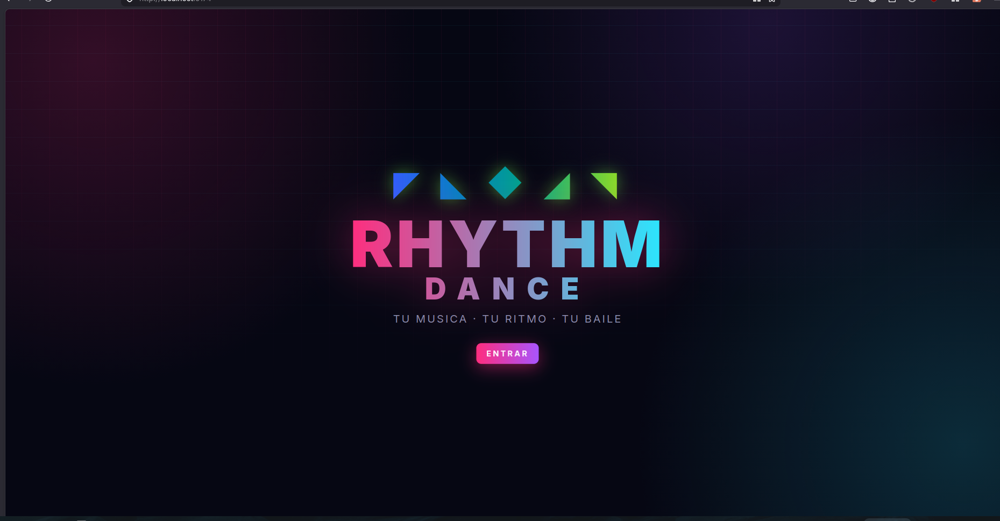
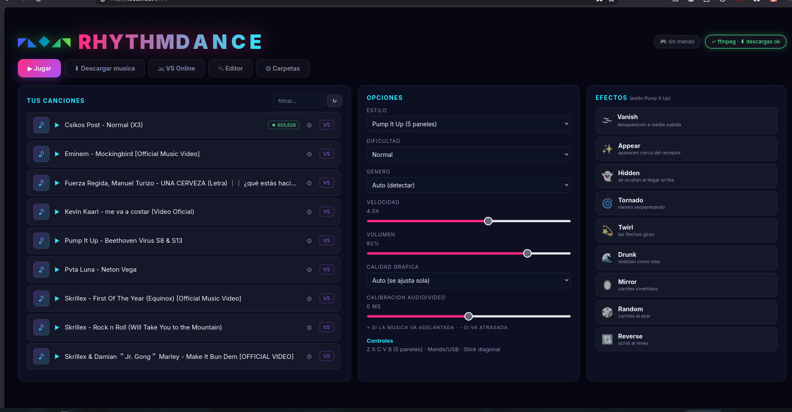
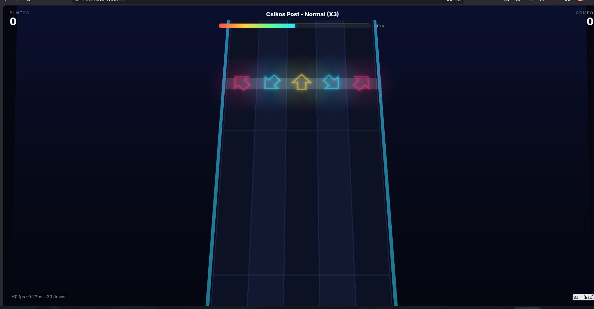
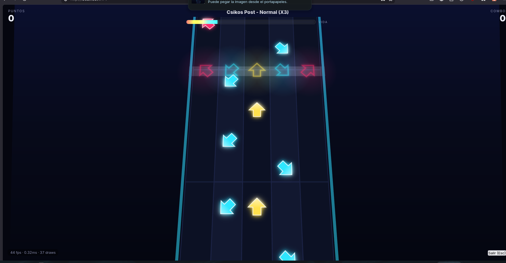
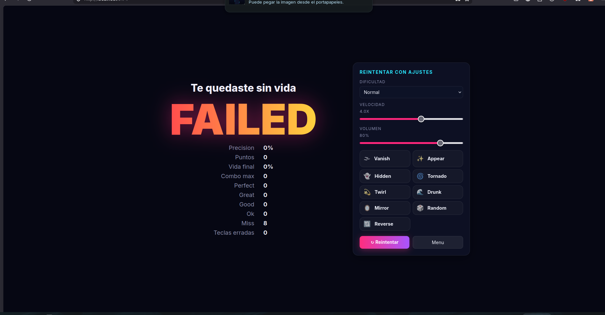

<div align="center">

# 🎵 Rhythm Dance

**Juego de baile estilo Pump It Up (5 paneles) y DDR (4 flechas), en 3D.**

Genera pistas sincronizadas al ritmo de **tu propia música**, juega contra un amigo
online, crea tus mapeos en el editor y más. Para **Windows, Linux y macOS**.

[](https://github.com/tuangel134/rhythm-dance/actions/workflows/build.yml)
[](https://github.com/tuangel134/rhythm-dance/releases/latest)

</div>

---

## ⬇️ Instalación

Hay dos formas. Elige la que prefieras.

### Opción 1 — Instalador listo (un comando, descarga el binario)

Descarga e instala el último release automáticamente.

**Windows** — abre **PowerShell** y pega:
```powershell
irm https://raw.githubusercontent.com/tuangel134/rhythm-dance/main/install.ps1 | iex
```

**Linux (Ubuntu / Zorin / Mint / Debian) y macOS** — abre una **terminal** y pega:
```bash
curl -fsSL https://raw.githubusercontent.com/tuangel134/rhythm-dance/main/install.sh | bash
```

Detecta tu sistema y baja el paquete correcto:
- **Windows** → instalador `.exe` (NSIS).
- **Debian/Ubuntu/Zorin/Mint** → paquete `.deb` (queda en el menú de apps).
- **Otras distros Linux** → `.AppImage` en `~/.local/bin`.
- **macOS** → `.dmg`.

> ¿A mano? Ve a **[Releases](https://github.com/tuangel134/rhythm-dance/releases/latest)**
> y baja el archivo de tu sistema.

### Opción 2 — Desde el código fuente (un comando, sin binarios pesados)

Clona el repo, instala dependencias y deja todo listo. Instala lo que falte
(git, Node.js, ffmpeg) usando el gestor de paquetes de tu sistema.

**Windows** — en **PowerShell**:
```powershell
irm https://raw.githubusercontent.com/tuangel134/rhythm-dance/main/setup-from-source.ps1 | iex
```

**Linux / macOS** — en una **terminal**:
```bash
curl -fsSL https://raw.githubusercontent.com/tuangel134/rhythm-dance/main/setup-from-source.sh | bash
```

Al terminar puedes jugar con `npm start` (navegador) o `npm run app` (app de escritorio).

---

## 🎮 ¿Qué es?

El motor corre en tu PC (un pequeño servidor Node) y la interfaz se dibuja en 3D
con three.js. Tú pones tu música; el juego la analiza y crea la pista de flechas
sincronizada al beat. Funciona con teclado o con mando/USB/tapete.

### Características

- **Generador de pistas inteligente**: análisis multibanda (bajo / medios / agudos /
  platillos), detección de BPM, anclaje de fase al bajo y **densidad por género**
  (electrónica, clásica, pop, rock, hip-hop). Los platillos crash/ride aumentan la
  probabilidad de **notas dobles/triples**.
- **6 dificultades**: Fácil, Normal, Ritmo (velocidad automática), Difícil, Experto y
  **Locura** (efectos + velocidad que cambian solos según el ritmo).
- **Notas dobles/triples y notas largas (holds)**.
- **Editor de pistas**: graba tus teclas en cámara lenta y, con la **edición fina** en
  un timeline 2D, mueve / borra / agrega flechas y ajusta holds con el ratón.
- **Modo VS online**: juega 1 contra 1 con un enlace para compartir; ves el **tablero
  del rival en tiempo real** con su barra de vida, y hay **revancha** sin salir de la sala.
- **Efectos visuales** (estilo PIU): Vanish, Appear, Hidden, Tornado, Twirl, Drunk,
  Mirror, Random, Reverse.
- **Calibración audio/vídeo**, **preferencias guardadas**, **pantalla de carga con
  progreso real**, **carátulas de las canciones**, **puntajes máximos** por canción.
- **Descargador de música** integrado (yt-dlp).
- **Barra de vida** con combos positivos y negativos; si llega a cero, pierdes.

---

## 📸 Capturas

<div align="center">









</div>

---

## 🕹️ Controles

- **Pump It Up (5 paneles)**: `Z X C V B`. Numpad: `1 7 5 9 3` (mismas posiciones físicas).
- **DDR (4 flechas)**: `← ↓ ↑ →` o `A S W D`.
- **Mando/USB/tapete**: conéctalo y pulsa un botón; sirven dpad, botones de cara y stick.

---

## 🛠️ Ejecutar desde el código fuente

Necesitas **Node.js 18+**, **ffmpeg** y **ffprobe** (y opcionalmente **yt-dlp** para
descargar música).

```bash
git clone https://github.com/tuangel134/rhythm-dance.git
cd rhythm-dance
npm install

# Modo navegador (abre http://localhost:5174)
npm start

# O como app de escritorio (ventana propia)
npm run app
```

En **Windows** también puedes hacer doble clic en `start-windows.bat`; en
**Linux/macOS**, ejecutar `./start.sh`.

### Generar tú mismo los instalables

```bash
npm run dist:linux   # AppImage + .deb   (en dist-app/)
npm run dist:win     # .exe NSIS + portable
npm run dist         # Linux + Windows juntos
```

> Para crear el `.exe` **desde Linux** hace falta Wine. Lo más cómodo es dejar que
> **GitHub Actions** lo construya por ti (ver abajo): los runners de Windows generan
> el `.exe` nativo sin Wine.

### Incluir ffmpeg en el paquete (opcional)

Si quieres que el instalable funcione en una PC **sin** ffmpeg, copia los binarios a
la carpeta `bin/` antes de empaquetar (ver `bin/README.md`). Se incluirán dentro del
paquete. Si no, la app usará el ffmpeg/yt-dlp del sistema (PATH).

---

## 🤖 Publicar releases con GitHub Actions

El repo trae un workflow (`.github/workflows/build.yml`) que compila para Windows,
Linux y macOS en la nube. Para publicar una versión nueva:

```bash
# sube tus cambios
git add -A && git commit -m "nueva versión" && git push

# crea un tag con la versión (debe empezar con v)
git tag v0.2.0
git push origin v0.2.0
```

Al detectar el tag, Actions construye los binarios de las 3 plataformas y los adjunta
automáticamente a un **Release** nuevo. Desde ahí los scripts `install.sh`/`install.ps1`
los descargan. (También se construye en cada push a `main`, dejando los binarios como
*artifacts* descargables desde la pestaña **Actions**.)

---

## 🌐 Modo VS online (contra un amigo)

1-contra-1 privado, sin matchmaking público.

### Opción A — Por internet con un enlace (recomendada)
1. En **VS Online**, pulsa **"Crear sala + enlace para compartir"**.
2. Copia el enlace (`https://algo.loca.lt/#join=K7QX`) y mándaselo a tu amigo.
3. Tu amigo lo abre en su navegador y entra directo. No instala nada, no necesita tu
   IP, y **no necesita tener la canción**: se reproduce desde tu PC.
   - Si le sale una página azul de aviso ("loca.lt"), que escriba la clave que muestra
     tu app (tu IP pública) y continúe. Solo una vez.
4. Elige una canción (botón **VS** en la lista), ambos pulsan **Listo** y arranca.
5. Al terminar, pulsa **⚔ Revancha** para jugar de nuevo sin salir de la sala.

### Opción B — Misma red local (sin internet)
1. Pulsa **"Crear sala (LAN)"**.
2. Tu amigo escribe tu **IP local** (la imprime la consola al arrancar, ej.
   `192.168.1.50:5174`) y el **código** de la sala, y pulsa **Unirse**.

> **Seguridad**: el servidor de salas no usa autenticación. Es para jugar con amigos
> de confianza en LAN/VPN o por el enlace temporal. No lo expongas abiertamente a
> internet sin protección adicional.

---

## 🧱 Arquitectura

```
electron/
  main.cjs       Proceso principal de la app de escritorio (arranca el motor + ventana).
server/
  index.js       API + streaming de audio + carátulas + WebSocket de salas (VS).
  decode.js      Decodifica audio a PCM con ffmpeg.
  generator.js   Generador de pistas sincronizado (multibanda + prior de tempo).
  library.js     Escaneo y gestión de carpetas de música.
  downloader.js  Búsqueda y descarga con yt-dlp.
  rooms.js       Salas VS (relay de 2 jugadores por código, con revancha).
  smparser.js    Lee stepcharts reales .sm/.ssc (StepMania) y .ucs (Pump It Up).
  songsettings.js  Ajustes por canción, puntajes y charts del editor.
  tools.js       Resolución multiplataforma de ffmpeg/ffprobe/yt-dlp.
src/
  main.js        Frontend: tabs, descargador, VS, flujo de juego, carga.
  prefs.js       Preferencias del jugador (localStorage).
  render/stage.js  Escena 3D (perspectiva, upscroll, arte procedural, pooling, efectos).
  game/game.js   Lógica: reloj suave, ventana activa de notas, juicios, vida, VS.
  game/editor.js   Editor: grabación en cámara lenta, holds, cuantización de acordes.
  game/timeline.js Edición fina 2D (mover/borrar/agregar notas, ajustar holds).
  game/rivalboard.js  Tablero del rival en tiempo real (VS).
  input/input.js Teclado + Gamepad (5 y 4 paneles).
  net/online.js  Cliente WebSocket del modo VS.
.github/workflows/build.yml   CI: construye y publica los instaladores.
```

---

## 🎼 Usar mapeos reales (stepcharts de la comunidad)

Para tus canciones favoritas puedes usar un mapeo hecho a mano en vez de la
autogeneración. El juego lee **.sm/.ssc** (StepMania) y **.ucs** (Pump It Up).

Pon el archivo del chart **junto al audio y con el mismo nombre**:
```
MiMusica/
  Csikos Post.mp3
  Csikos Post.ssc      <- el chart
```
En la lista aparecerá la etiqueta **CHART** y al jugar se usará ese mapeo. Si no hay
chart, se autogenera como siempre.

---

## ⚡ Rendimiento

- Solo se procesa una **ventana activa** de notas por frame (no toda la canción).
- **Pooling** de mallas/efectos; geometría y texturas compartidas.
- Pixel ratio acotado y **calidad adaptativa** (baja sola si los FPS caen).
- Contador de FPS / ms de CPU / draws en la esquina durante el juego.
- Las pistas generadas se **cachean** (no se regeneran la próxima vez).

Si no llegas al máximo de tu monitor: prueba pantalla completa (F11) y activa la
aceleración por hardware del navegador.

---

## 🧪 Pruebas

```bash
node test/verify-generator.mjs   # alineación al beat
node test/verify-multiband.mjs   # detección de pulso
node test/verify-rooms.mjs       # flujo completo de sala VS
node test/verify-editor.mjs      # cuantización del editor
# ... y el resto de test/verify-*.mjs
```

---

## 📜 Créditos / licencias

- Todo el arte visual del juego es **procedural** (generado por código), bajo licencia GPL-3.0.
- Descargas vía **yt-dlp**; el usuario es responsable del uso del contenido y de
  respetar los derechos de autor.
